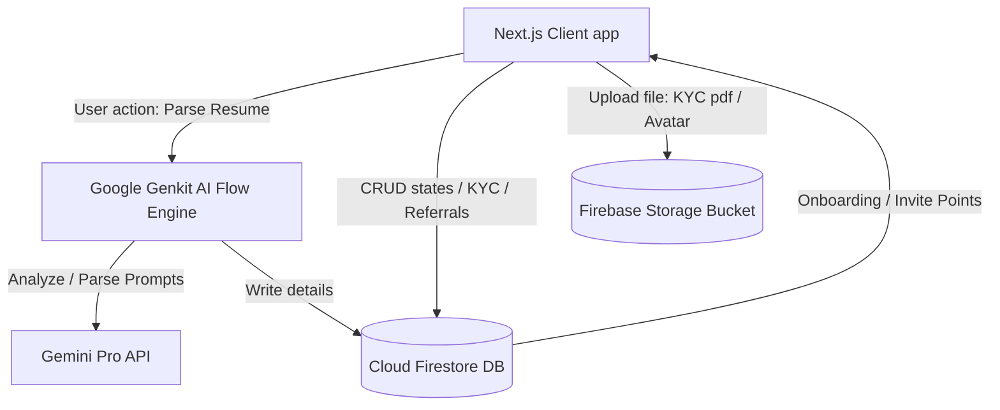
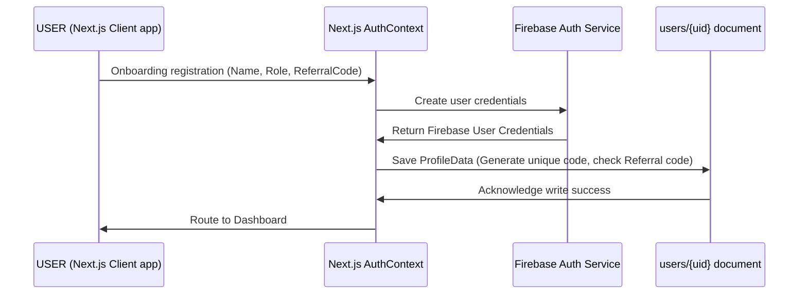
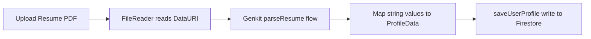

# Architecture & Design Overview

This document illustrates the technical design patterns, modular architecture, and service boundaries of the Yuva Samrajya ecosystem.

---

## 🗂️ Component Interaction Chart

---

## 🔑 Authentication Architecture

---

## 📦 Database Design Patterns

We use `src/firebase/non-blocking-updates.ts` to perform database modifications asynchronously. This pattern avoids delaying UI rendering:

- **KYC Submissions**: Stored under `/kyc_requests/{userId}` document collection. Statuses track `Pending`, `Approved`, or `Rejected`.
- **Referral Connections**: Stored under `/referrals/{referrerId_referredId}`.
- **User Points**: Counters increment using `increment(100)` directly in transaction-safe updates.

---

## 🤖 AI Service Workflows

We use Google Genkit flows inside `src/ai/flows/`:

