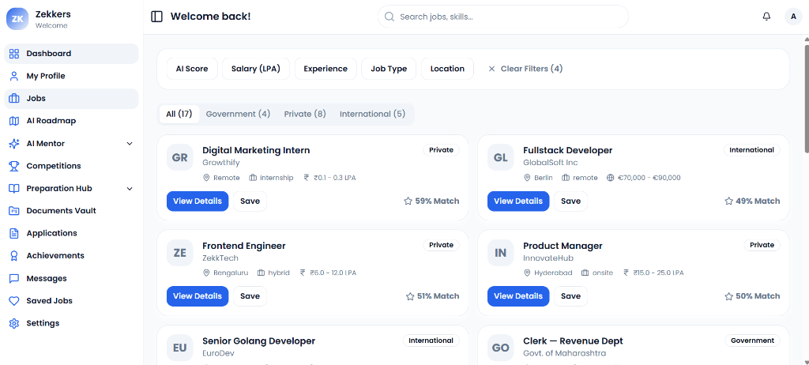
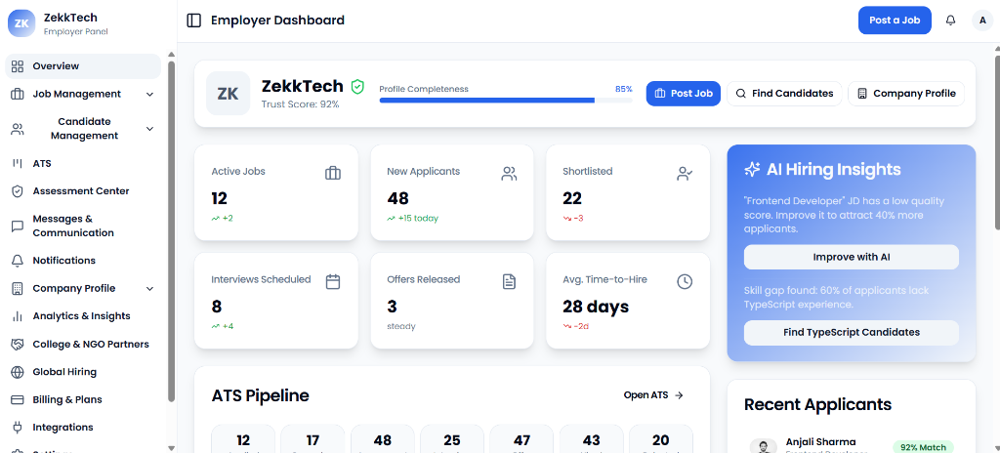
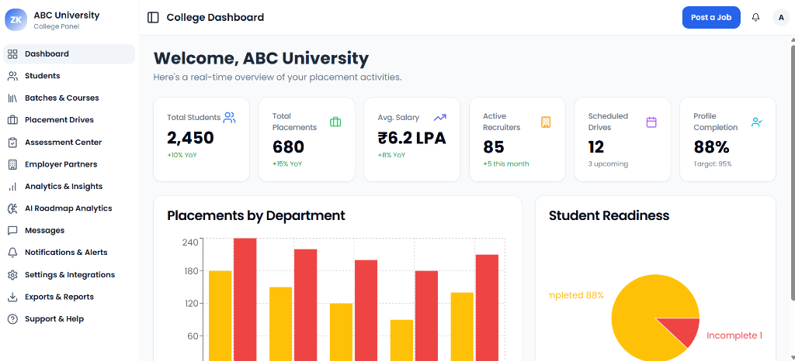
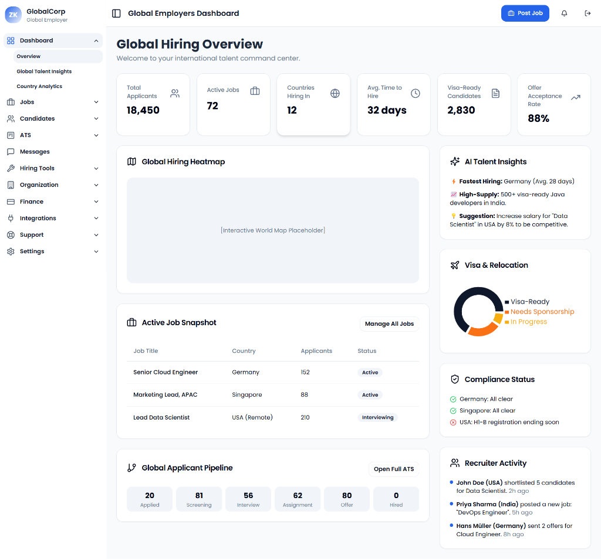
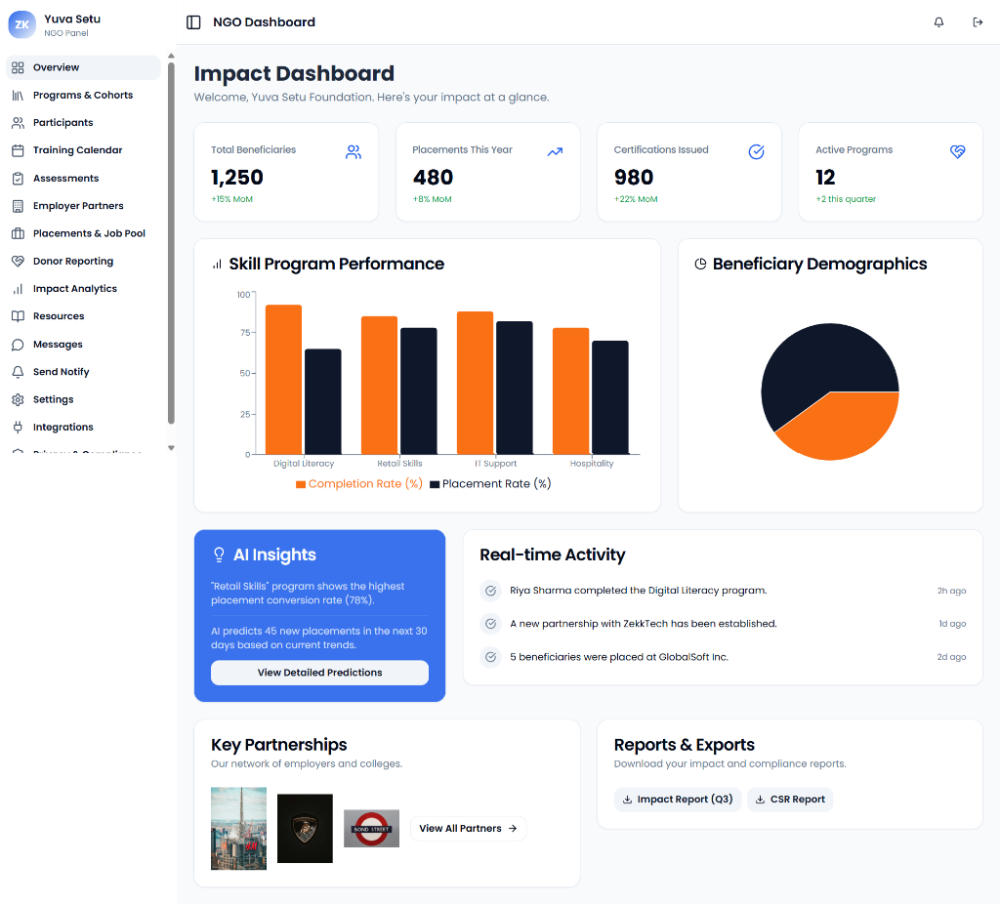
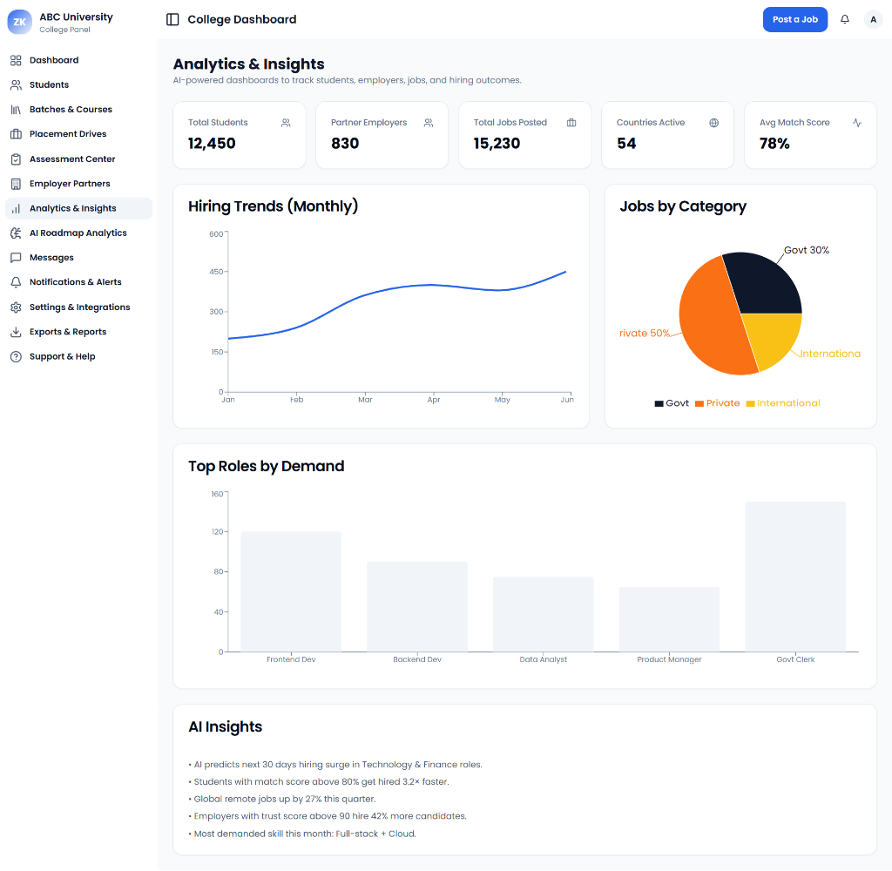
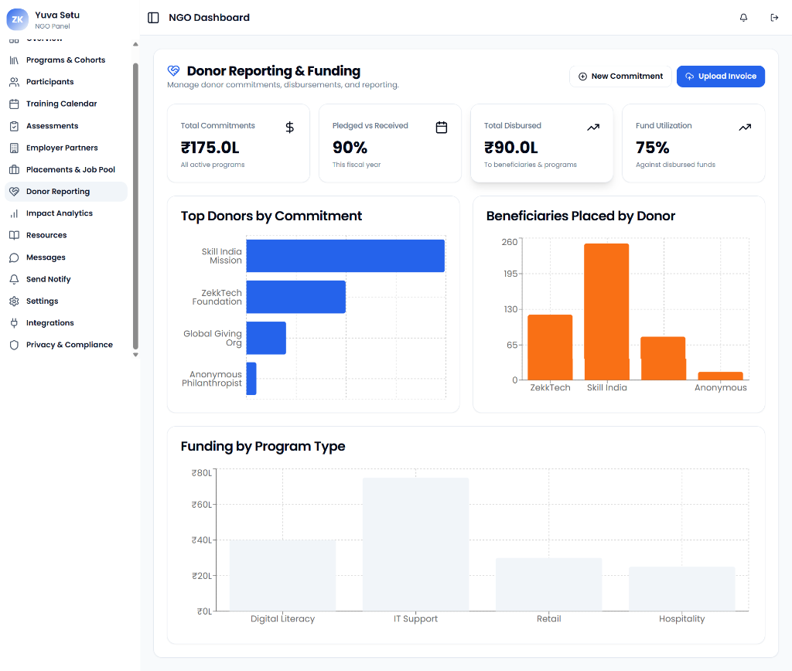

# 🚀 Zekkers — Smart Seekers. Verified Opportunities. AI-Powered Futures.

<div align="center">

[](https://nextjs.org/)
[](https://reactjs.org/)
[](https://www.typescriptlang.org/)
[](https://firebase.google.com/)
[](https://tailwindcss.com/)

**A unified career ecosystem connecting students, professionals, employers, colleges, NGOs, and institutions with government, private, and global opportunities.**

[Live Demo](https://zekkers-app2.vercel.app) • [Report Bug](https://github.com/yuvasamrajyaofficial-prog/zekkers-app2/issues) • [Request Feature](https://github.com/yuvasamrajyaofficial-prog/zekkers-app2/issues)

</div>

---

## 📋 Table of Contents

- [About The Project](#about-the-project)
- [Key Features](#key-features)
- [Tech Stack](#tech-stack)
- [Getting Started](#getting-started)
  - [Prerequisites](#prerequisites)
  - [Installation](#installation)
  - [Environment Variables](#environment-variables)
- [Usage](#usage)
- [Project Structure](#project-structure)
- [AI Features](#ai-features)
- [Dashboards](#dashboards)
- [Contributing](#contributing)
- [License](#license)
- [Contact](#contact)

---

## 🎯 About The Project

**Zekkers** is a comprehensive career platform that bridges the gap between job seekers and verified employers through AI-driven matching, secure profiles, and transparent hiring workflows. The platform caters to multiple stakeholders including:

- 🎓 **Students & Job Seekers** — Browse government, private, and global opportunities
- 🏢 **Employers** — Post jobs, manage ATS, access AI-powered candidate matching
- 🏫 **Colleges** — Track placements, manage campus drives, analytics
- 🤝 **NGOs** — Support skill development and placements
- 🌍 **Global Employers** — International hiring and remote opportunities
- 👨‍💼 **Admin** — Platform management and oversight

---

## 📸 Screenshots

### Student Dashboard


_Smart job recommendations with AI-powered match scores for government, private, and international opportunities_

### Employer Dashboard


_Complete hiring dashboard with ATS pipeline, AI insights, and candidate management_

### College Dashboard


_Real-time placement tracking with department analytics and student readiness metrics_

### Global Employer Dashboard


_International hiring with global talent insights, visa tracking, and multi-country analytics_

### NGO Dashboard


_Track beneficiaries, skill programs, placements, and social impact metrics_

### College Analytics & Insights


_AI-powered analytics with hiring trends, job categories, and actionable placement insights_

### NGO Donor Reporting


_Comprehensive donor management with commitment tracking and program funding analytics_

> **Note:** Screenshots coming soon! The app is live and fully functional.

---

## ✨ Key Features

### 🔍 For Job Seekers

- **AI Job Matching** — Smart recommendations based on profile and skills
- **Resume Analyzer** — AI-powered resume scoring and suggestions
- **Skill Roadmaps** — Personalized learning paths powered by AI
- **Interview Prep** — AI mock interviews with real-time feedback
- **Competition Tracking** — Track coding competitions and hackathons

### 💼 For Employers

- **Applicant Tracking System (ATS)** — Kanban-style candidate management
- **AI Candidate Finder** — Intelligent candidate search and ranking
- **Campus Hiring** — Manage college partnerships and drives
- **Skill Gap Analysis** — AI-powered workforce insights
- **Global Hiring** — Remote job postings and international talent pool

### 🏫 For Colleges

- **Placement Analytics** — Track student placements and outcomes
- **Campus Drive Management** — Schedule and manage recruitment drives
- **Student Progress Tracking** — Monitor skill development
- **Employer Partnerships** — Manage corporate collaborations

### 🤖 AI-Powered Features

- **Resume Analysis & Scoring** — Get instant feedback with match scores (0-100)
- **Smart Job Matching** — AI ranks jobs based on your skills and preferences
- **Skill Gap Identification** — Discover missing skills for target roles
- **Voice AI Interviews** — Practice with realistic AI mock interviews
- **Career Roadmaps** — Personalized learning paths generated by AI
- **Intelligent Notifications** — Context-aware alerts and recommendations
- **Automated Screening** — AI pre-screens candidates for employers
- **Sentiment Analysis** — Analyze application and interview responses

### 🔧 Platform Features

- **Real-Time Updates** — Live notifications and data synchronization
- **Responsive Design** — Works seamlessly on desktop, tablet, and mobile
- **Dark Mode** — Eye-friendly dark theme support
- **Advanced Search** — Full-text search with filters
- **Data Export** — Export data to PDF, CSV, Excel
- **API Access** — RESTful API for integrations

### 📊 Analytics & Insights

- **Placement Dashboard** — Comprehensive placement tracking
- **Performance Metrics** — KPIs for employers and colleges
- **Trend Analysis** — Industry and skill trends
- **Custom Reports** — Generate custom analytics reports
- **Data Visualization** — Interactive charts and graphs
- **Predictive Analytics** — AI-powered hiring predictions

---

## 🛠 Tech Stack

### Frontend

- **Framework:** Next.js 16.0.7 (React 19)
- **Language:** TypeScript
- **Styling:** Tailwind CSS
- **UI Components:** Radix UI, Shadcn/ui
- **Animations:** Framer Motion
- **Forms:** React Hook Form + Zod validation
- **Charts:** Recharts

### Backend & Services

- **Backend:** Firebase (Firestore, Auth, Storage, Functions)
- **AI/ML:** Google Genkit AI
- **API Integration:** RESTful APIs, Firebase Cloud Functions

### DevOps

- **Deployment:** Vercel / Firebase Hosting
- **CI/CD:** GitHub Actions
- **Version Control:** Git & GitHub

---

## 🚀 Getting Started

### Prerequisites

- Node.js 18.x or higher
- npm or yarn package manager
- Firebase account (for backend services)
- Git


### Environment Variables

See `.env.example` for all available configuration options.

---

## 📖 Usage

### Development

```bash
npm run dev          # Start development server
npm run build        # Build for production
npm run start        # Start production server
npm run lint         # Run ESLint
```

### Firebase Functions

```bash
cd functions
npm run serve        # Test functions locally
npm run deploy       # Deploy to Firebase
```

### Genkit AI Development

```bash
npm run genkit:dev   # Start Genkit development server
npm run genkit:watch # Watch mode for AI flows
```

---

## 📁 Project Structure

```
zekkers-app2/
├── src/
│   ├── app/                    # Next.js App Router pages
│   │   ├── dashboard/          # Job seeker dashboard
│   │   ├── employer-dashboard/ # Employer dashboard
│   │   ├── college-dashboard/  # College dashboard
│   │   ├── ngo-dashboard/      # NGO dashboard
│   │   └── admin-dashboard/    # Admin dashboard
│   ├── components/             # Reusable React components
│   │   ├── ui/                 # Shadcn/ui components
│   │   └── analytics/          # Analytics components
│   ├── ai/                     # AI/ML integration
│   │   └── flows/              # Genkit AI flows
│   ├── lib/                    # Utility functions
│   ├── services/               # API service layers
│   ├── hooks/                  # Custom React hooks
│   ├── types/                  # TypeScript type definitions
│   └── firebase/               # Firebase configuration
├── functions/                  # Firebase Cloud Functions
├── public/                     # Static assets
└── docs/                       # Documentation
```

---

## 🤖 AI Features

Zekkers leverages **Google Genkit AI** for intelligent features:

### Resume Analyzer Flow

Analyzes resumes against job descriptions and provides:

- Match score (0-100)
- Strengths and weaknesses
- Improvement suggestions

### AI Ranking Engine

Ranks job postings based on candidate profile:

- Skill matching
- Experience alignment
- Location preferences

### Interview AI Flow

Conducts AI-powered mock interviews with:

- Voice interaction
- Real-time feedback
- Performance scoring

---

## 🎛 Dashboards

### Student Dashboard (`/dashboard`)

- Job search and recommendations
- Resume builder and analyzer
- Competition tracker
- Interview preparation
- Skill roadmaps

### Employer Dashboard (`/employer-dashboard`)

- Job posting management
- ATS and candidate pipeline
- AI candidate finder
- Campus hiring
- Analytics and insights

### College Dashboard (`/college-dashboard`)

- Placement tracking
- Student analytics
- Campus drive management
- Employer partnerships

### NGO Dashboard (`/ngo-dashboard`)

- Program management
- Participant tracking
- Placement coordination
- Impact analytics

### Global Employer Dashboard (`/global-employers-dashboard`)

- International job postings
- Remote hiring tools
- Global candidate pool
- Compliance and documentation

### Admin Dashboard (`/admin-dashboard`)

- Platform management
- User management
- Analytics and reporting
- System configuration

---

## 🔒 Security & Privacy

Zekkers takes security and privacy seriously:

### Authentication & Authorization

- ✅ **Firebase Authentication** — Secure email/password and OAuth login
- ✅ **Role-Based Access Control (RBAC)** — Granular permissions for each dashboard
- ✅ **Session Management** — Secure token-based sessions
- ✅ **Multi-Factor Authentication** — Optional 2FA for enhanced security

### Data Protection

- 🔐 **End-to-End Encryption** — All data in transit encrypted with HTTPS
- 🔐 **Database Security** — Firestore security rules for data access control
- 🔐 **PII Protection** — Personal Identifiable Information handled per GDPR/CCPA
- 🔐 **Resume Storage** — Secure Firebase Storage with access controls

### Compliance

- ✅ **GDPR Compliant** — Data privacy and user rights
- ✅ **CCPA Compliant** — California Consumer Privacy Act
- ✅ **ISO 27001** — Information security management standards
- ✅ **Data Retention Policies** — Configurable data lifecycle management

### AI Safety

- 🤖 **Content Moderation** — AI-powered content filtering
- 🤖 **Bias Mitigation** — Fair and unbiased AI recommendations
- 🤖 **Data Minimization** — Only necessary data used for AI processing
- 🤖 **Transparent AI** — Clear explanations for AI decisions

### Security Features

- 🛡️ **XSS Protection** — Cross-site scripting prevention
- 🛡️ **CSRF Protection** — Cross-site request forgery tokens
- 🛡️ **Rate Limiting** — API abuse prevention
- 🛡️ **Input Validation** — Zod schema validation on all inputs
- 🛡️ **SQL Injection Prevention** — NoSQL database (Firestore)
- 🛡️ **Security Headers** — CSP, HSTS, X-Frame-Options configured

### Reporting Security Issues

If you discover a security vulnerability, please email:
**security@zekkers.com**

Do NOT create public GitHub issues for security vulnerabilities.

---

## 🤝 Contributing

Contributions are what make the open-source community amazing! Any contributions you make are **greatly appreciated**.

1. Fork the Project
2. Create your Feature Branch (`git checkout -b feature/AmazingFeature`)
3. Commit your Changes (`git commit -m 'Add some AmazingFeature'`)
4. Push to the Branch (`git push origin feature/AmazingFeature`)
5. Open a Pull Request

---

## 📄 License

Distributed under the MIT License. See `LICENSE` for more information.

---

## 📧 Contact

**Yuva Samrajya Official**

- GitHub: [@yuvasamrajyaofficial-prog](https://github.com/yuvasamrajyaofficial-prog)
- Project Link: [https://github.com/yuvasamrajyaofficial-prog/zekkers-app2](https://github.com/yuvasamrajyaofficial-prog/zekkers-app2)

---

## 🙏 Acknowledgments

- [Next.js](https://nextjs.org/)
- [Firebase](https://firebase.google.com/)
- [Google Genkit AI](https://firebase.google.com/products/genkit)
- [Shadcn/ui](https://ui.shadcn.com/)
- [Radix UI](https://www.radix-ui.com/)
- [Tailwind CSS](https://tailwindcss.com/)

---

<div align="center">

**Made with ❤️ by the Prashant**

© 2025 Zekkers — Powered by MCT. All rights reserved.

</div>
