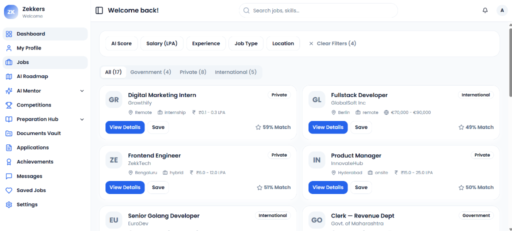
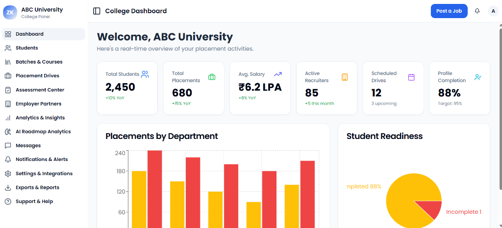
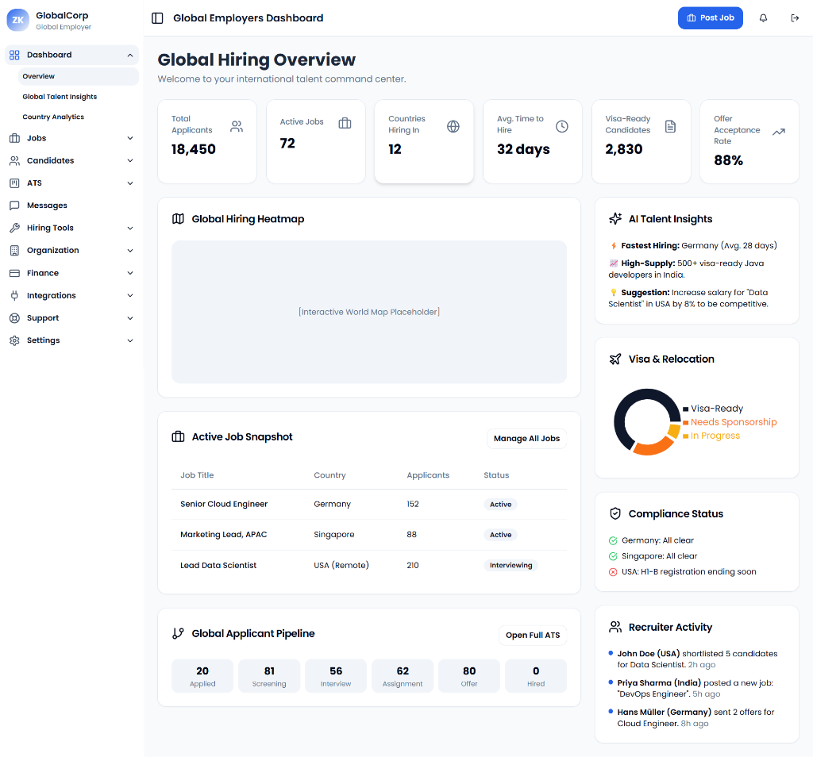
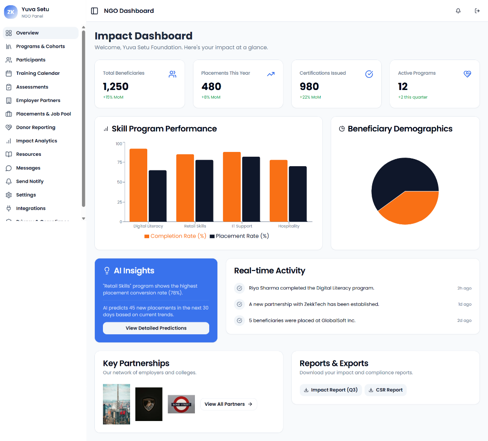
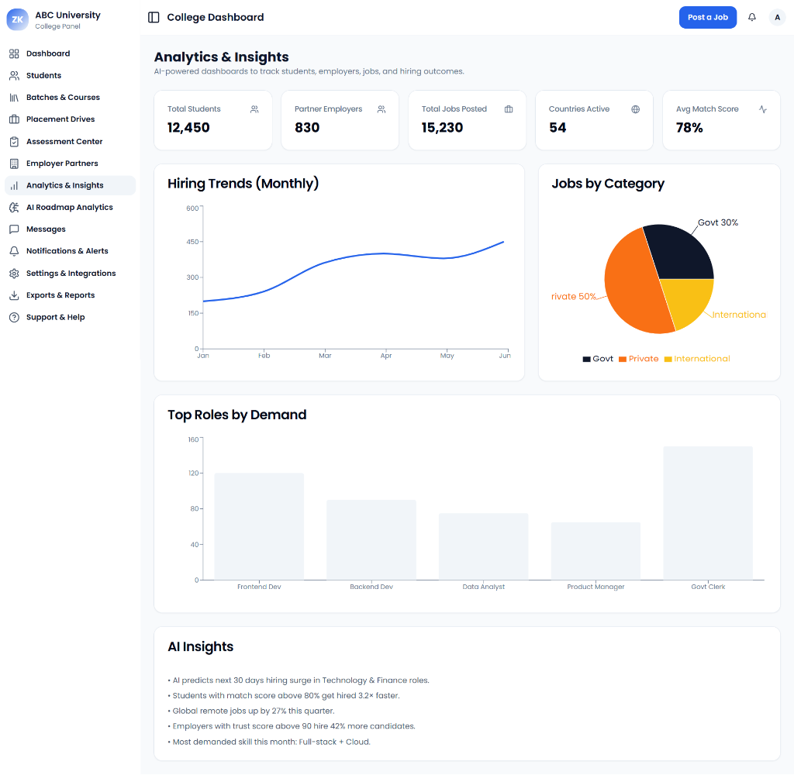
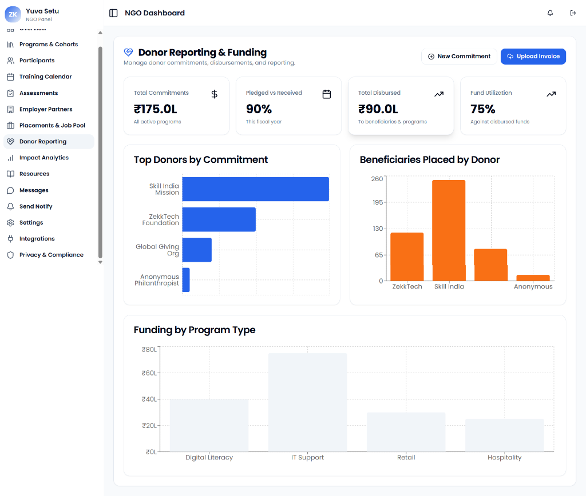

# 🚀 Zekkers & Malola Ecosytem — Yuva Samrajya

<div align="center">

[](https://nextjs.org/)
[](https://reactjs.org/)
[](https://www.typescriptlang.org/)
[](https://firebase.google.com/)
[](https://tailwindcss.com/)

**A unified open-source ecosystem bridging state-of-the-art AI technology with career opportunities (Zekkers) and spiritual discovery (Malola).**

[Live Zekkers Demo](https://zekkers-app2.vercel.app) • [Report Bug](https://github.com/yuvasamrajyaofficial-prog/zekkers-app2/issues) • [Request Feature](https://github.com/yuvasamrajyaofficial-prog/zekkers-app2/issues)

</div>

---

## 📋 Table of Contents

- [About The Project](#about-the-project)
  - [Zekkers: AI-Powered Career Platform](#1-zekkers-ai-powered-career-platform)
  - [Malola: AI-Powered Spiritual Ecosystem](#2-malola-ai-powered-spiritual-ecosystem)
- [Mission, Vision & Core Values](#mission-vision--core-values)
- [Key Features](#key-features)
  - [Zekkers Features](#zekkers-features)
  - [Malola Features](#malola-features)
- [Screenshots](#screenshots)
- [Tech Stack](#tech-stack)
- [Getting Started](#getting-started)
- [Usage & Development](#usage--development)
- [Project Structure](#project-structure)
- [Security & Privacy](#security--privacy)
- [Contributing](#contributing)
- [License](#license)
- [Contact](#contact)

---

## 🎨 About The Project

Yuva Samrajya develops technologies designed to uplift users, providing access to top-tier career placements and balanced mental and spiritual discovery.

### 💼 1. Zekkers: AI-Powered Career Platform

**Zekkers** is a comprehensive career platform that bridges the gap between job seekers and verified employers through AI-driven matching, secure profiles, and transparent hiring workflows. The platform caters to multiple stakeholders including:

- 🎓 **Students & Job Seekers** — Browse government, private, and global opportunities.
- 🏢 **Global Employers** — Post jobs, manage ATS, access AI-powered candidate matching.
- 🏫 **Colleges** — Track placements, manage campus drives, and review student analytics.
- 🤝 **NGOs** — Support skill development, program budgets, and beneficiary placements.

### 🕉️ 2. Malola: AI-Powered Spiritual Ecosystem

**Malola** connects traditional wisdom with modern convenience, offering a voice-first environment for personal reflection and guidance:

- 🌌 **Spiritual AI Partner** — Virtual chat assistant providing guidance drawing on Vedic texts.
- 📅 **Astrology Computations** — Real-time astronomical charts, transits, and daily reflections.
- 📖 **Media & Scripture Vault** — Open access Sanskrit transcriptions, audio verses, and historical PDFs.
- 🏪 **Cultural Marketplace** — Community registers for temple events and floral offerings.

---

## 🌟 Mission, Vision & Core Values

### Our Mission

To build secure, open-source technology frameworks that empower early-career developers while offering a sanctuary for mindful reflection.

### Our Vision

A world where high-fidelity AI products are accessible, transparent, and built collaboratively by developers, students, and practitioners worldwide.

---

## ✨ Key Features

### Zekkers Features

- **AI Job Matching & Scoring** — Smart recommendations based on candidate profile and skills.
- **Resume AI Studio** — Real-time parsing (AI resume analyzer) and direct profile integration.
- **Dynamic Roadmaps** — Custom, step-by-step career path planners.
- **Voice AI Interviews** — Practice with realistic audio assessments and feedback.
- **Applicant Tracking System (ATS)** — Kanban-style candidate pipelines for employers.
- **Campus & NGO Partnerships** — Complete placement tracking analytics and donor reporting.

### Malola Features

- **Personal Horoscope calculations** — Visual natal charts and Vedic analysis.
- **Voice-first meditations** — Guided breathing timers and progress monitors.
- **Interactive Temple locator** — Maps tracking temple histories, coordinates, and timings.
- **Scriptures Library** — Comprehensive search filters for Indian epic scriptures.

---

## 📸 Screenshots

### Student Dashboard


_Smart job recommendations with AI-powered match scores for government, private, and international opportunities_

### College Dashboard


_Real-time placement tracking with department analytics and student readiness metrics_

### Global Employer Dashboard


_International hiring with global talent insights, visa tracking, and multi-country analytics_

### NGO Dashboard


_Track beneficiaries, skill programs, placements, and social impact metrics_

### College Analytics & Insights


_AI-powered analytics with hiring trends, job categories, and actionable placement insights_

### NGO Donor Reporting


_Comprehensive donor management with commitment tracking and program funding analytics_

> **Note:** Screenshots coming soon! The app is live and fully functional.

---

## 🛠️ Tech Stack

### Frontend

- **Framework:** Next.js 16.0.7 (React 19)
- **Language:** TypeScript
- **Styling:** Tailwind CSS + Vanilla CSS variables
- **UI Components:** Radix UI, Shadcn/ui, Framer Motion
- **Charts:** Recharts

### Backend & Services

- **Backend:** Firebase (Firestore, Auth, Storage, Cloud Functions)
- **AI/ML:** Google Genkit AI
- **API Integration:** RESTful APIs, Firebase Cloud Functions

### DevOps

- **Deployment:** Vercel / Firebase App Hosting
- **CI/CD:** GitHub Actions
- **Version Control:** Git & GitHub

---

## 🚀 Getting Started

### Prerequisites

- Node.js 18.x or higher
- npm or yarn package manager
- Firebase account (configured with Firestore and Storage)
- Git

### Environment Variables

Configure your environment using `.env.example` as a template (refer to [INSTALLATION.md](INSTALLATION.md)).

---

## ⚙️ Usage & Development

### Development

```bash
npm run dev          # Start development server
npm run build        # Build for production
npm run start        # Start production server
npm run lint         # Run ESLint
```

### Firebase Functions

```bash
cd functions
npm run serve        # Test functions locally
npm run deploy       # Deploy to Firebase
```

### Genkit AI Development

```bash
npm run genkit:dev   # Start Genkit development server
npm run genkit:watch # Watch mode for AI flows
```

---

## 📂 Project Structure

```
zekkers-app2/
├── .github/                  # Github workflows, templates, and configurations
├── src/
│   ├── app/                    # Next.js App Router pages
│   │   ├── dashboard/          # Job seeker dashboard
│   │   ├── college-dashboard/  # College dashboard
│   │   ├── ngo-dashboard/      # NGO dashboard
│   │   ├── admin-dashboard/    # Admin dashboard
│   │   └── global-employers-dashboard/ # Employer Dashboard
│   ├── components/             # Reusable React components
│   ├── ai/                     # AI/ML integration (Genkit flows)
│   ├── lib/                    # Utility functions
│   ├── services/               # API service layers
│   ├── hooks/                  # Custom React hooks
│   ├── types/                  # TypeScript type definitions
│   └── firebase/               # Firebase configuration
├── functions/                  # Firebase Cloud Functions
├── public/                     # Static assets
└── docs/                       # Documentation
```

---

## 🔒 Security & Privacy

Zekkers and Malola secure all user payloads:

- **Authentication & Authorization** — Firebase Authentication paired with Role-Based Access Control (RBAC).
- **Data Protection** — All transit data encrypted using HTTPS. Secure Firestore rules guard database transactions.
- **PII Protection** — GDPR-compliant personal information policies.
- **Reporting Security Issues** — If you discover a vulnerability, please reach out to **security@yuvasamrajya.org** as outlined in [SECURITY.md](SECURITY.md).

---

## 🤝 Contributing

Contributions make the open-source community an amazing place! Any contributions you make are greatly appreciated.
Please read our [CONTRIBUTING.md](CONTRIBUTING.md) to understand standards, coding patterns, and pull request procedures.

---

## 📄 License

Distributed under the Apache 2.0 License. See [LICENSE.md](LICENSE.md) for details.

---

## 👥 Contact

**Yuva Samrajya Official**

- GitHub: [@yuvasamrajyaofficial-prog](https://github.com/yuvasamrajyaofficial-prog)
- Project Link: [https://github.com/yuvasamrajyaofficial-prog/zekkers-app2](https://github.com/yuvasamrajyaofficial-prog/zekkers-app2)
