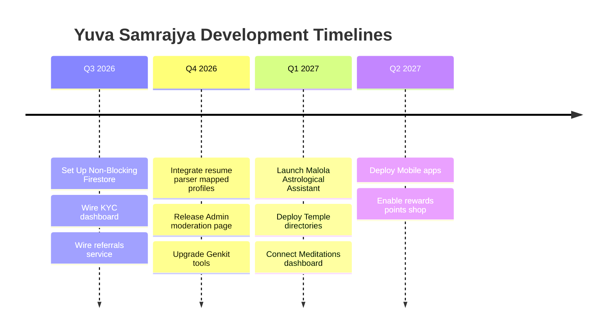

# Ecosystem Roadmap

This document outlines the milestones and roadmap details for both **Zekkers** & **Malola**.

---

## 📌 Milestones Overview

---

## 💼 Zekkers (Career Hub) Roadmap

### Milestone 1: Firestore Data Sync (Completed)

- Replace mock data storage with persistent Firestore operations.
- Wire Employer KYC steps (documents, DUNS, banks).
- Support Admin dashboard verification operations.

### Milestone 2: Referral Engine & AI Intake (In-Progress)

- Setup client dashboard showing invitation stats, levels, and codes.
- Implement resume parsing outputs directly overwriting user profile schemas.
- Enable referral reward point rules.

### Milestone 3: AI Interviewer & Interactive Roadmaps (Planned)

- Implement speech-to-text evaluations for Candidates.
- Launch skill gap indicators on resume analysis.

---

## 🕉️ Malola (Spiritual Hub) Roadmap

### Milestone 1: Media Vault and Scriptures (In-Progress)

- Daily audio transcripts of spiritual scriptures.
- Search and query options for Sanskrit shlokas.

### Milestone 2: Astro-AI and Horoscopes (Planned)

- Integrate celestial calculations to output personal charts.
- Customized daily insight digest.

### Milestone 3: E-Commerce & Temple Directories (Planned)

- Enable flower delivery shop and spiritual items marketplace.
- Community guides and interactive locator maps for cultural events.
